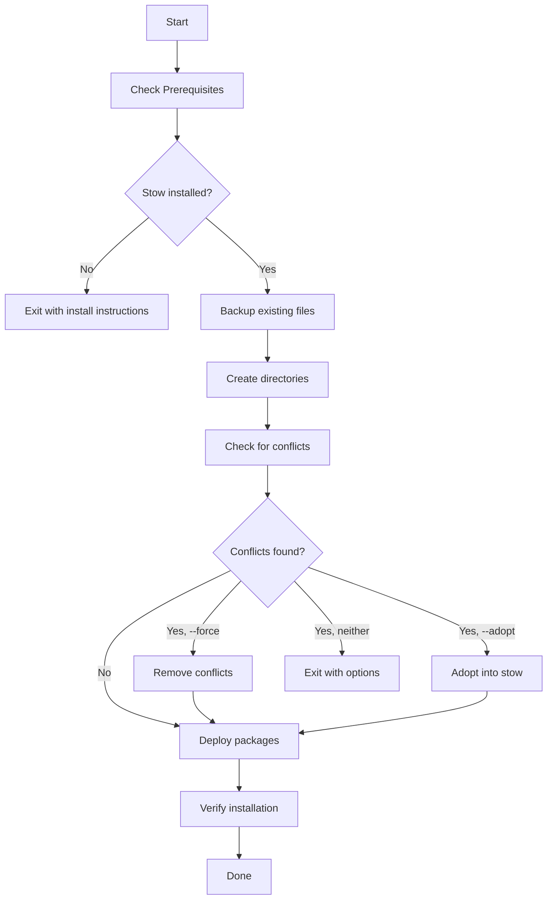
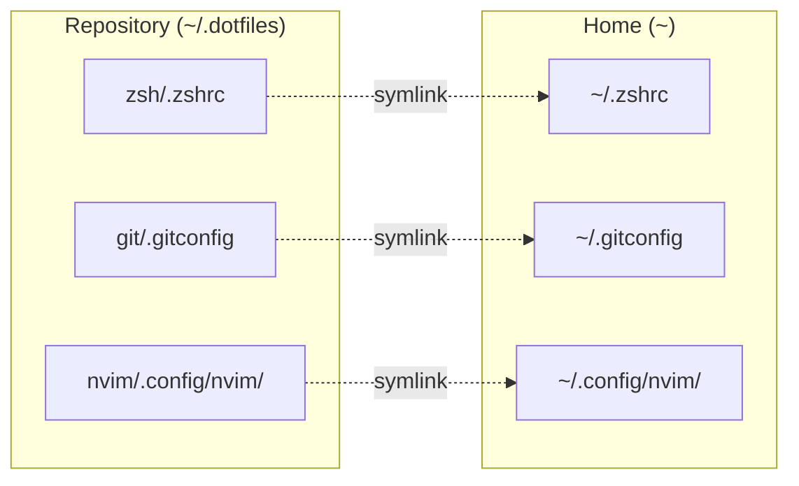
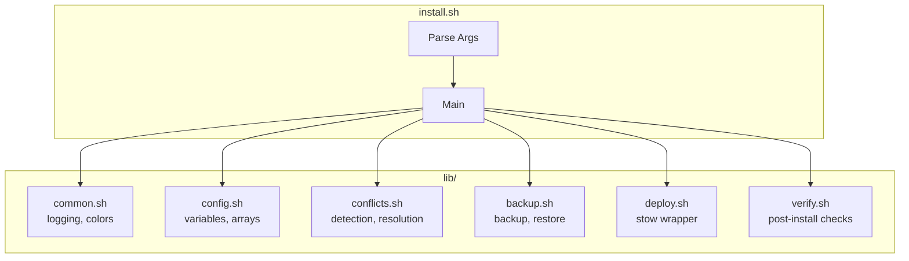
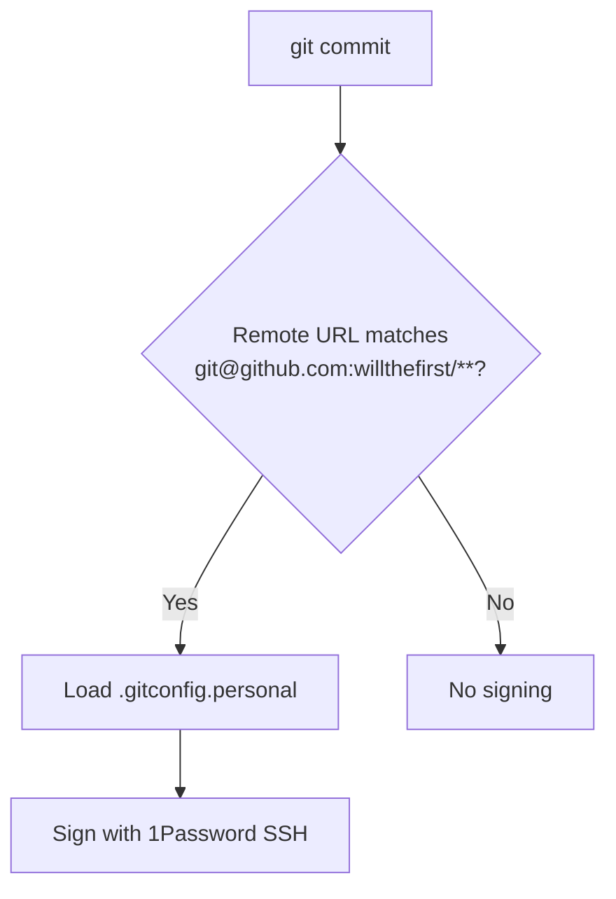

# Dotfiles

Personal dotfiles managed with [GNU Stow](https://www.gnu.org/software/stow/).

## Overview

Portable configuration files for zsh, git, neovim, ssh, and ghostty.

## Structure

```
~/.dotfiles/
├── install.sh              # Main installer (sources lib/)
├── validate.sh             # Config validation script
├── Makefile                # Convenience commands
├── lib/                    # Modular shell libraries
│   ├── common.sh           # Logging, colors, utilities
│   ├── config.sh           # Configuration variables
│   ├── conflicts.sh        # Conflict detection/resolution
│   ├── backup.sh           # Backup and restore logic
│   ├── deploy.sh           # Stow deployment
│   └── verify.sh           # Installation verification
├── tests/                  # Automated test suite
│   ├── test_runner.sh      # Test harness
│   ├── test_conflicts.sh   # Conflict detection tests
│   ├── test_backup.sh      # Backup logic tests
│   └── test_deploy.sh      # Deployment tests
├── .github/workflows/      # CI/CD
│   └── ci.yml              # GitHub Actions workflow
├── zsh/
│   └── .zshrc              # Shell config
├── git/
│   ├── .gitconfig          # Git config
│   ├── .gitconfig.personal # Personal repo signing (1Password SSH)
│   └── .gitignore_global   # Global gitignore
├── nvim/
│   └── .config/nvim/       # Neovim config
├── ssh/
│   └── .ssh/config         # SSH config
└── ghostty/
    └── .config/ghostty/    # Ghostty terminal config
```

## Installation

### Prerequisites

```bash
# macOS
brew install stow

# Ubuntu/Debian
sudo apt install stow
```

### Dependencies (Optional)

These tools enhance the shell experience but are not required:

| Tool                                            | Purpose        | Install                                                                                           |
| ----------------------------------------------- | -------------- | ------------------------------------------------------------------------------------------------- |
| [Oh My Zsh](https://ohmyz.sh/)                  | Zsh framework  | `sh -c "$(curl -fsSL https://raw.githubusercontent.com/ohmyzsh/ohmyzsh/master/tools/install.sh)"` |
| [zoxide](https://github.com/ajeetdsouza/zoxide) | Smarter cd     | `brew install zoxide`                                                                             |
| [Pure](https://github.com/sindresorhus/pure)    | Minimal prompt | `brew install pure`                                                                               |

### Quick Start

```bash
# Clone the repository
git clone https://github.com/willthefirst/.dotfiles.git ~/.dotfiles

# Run the install script
cd ~/.dotfiles
./install.sh
```

### Install Options

| Option    | Description                                                     |
| --------- | --------------------------------------------------------------- |
| `--force` | Remove conflicting symlinks/files before stowing                |
| `--adopt` | Adopt existing files into stow packages (keeps current content) |
| `--help`  | Show usage information                                          |

```bash
# Automatically remove conflicting files
./install.sh --force

# Or adopt existing files into stow (preserves your current config content)
./install.sh --adopt
```

### Installation Flow



## Make Commands

Use the Makefile for common operations:

```bash
make help           # Show all available commands
make install        # Install dotfiles
make install-force  # Install, removing conflicts
make install-adopt  # Install, adopting existing files
make test           # Run test suite (21 tests)
make lint           # Run ShellCheck on all scripts
make validate       # Validate config files
make clean          # Remove backups older than 7 days
make uninstall      # Remove all symlinks
```

## How GNU Stow Works

Stow creates symlinks from your home directory to files in the repository:



The directory structure inside each "package" (zsh/, git/, etc.) mirrors where files should appear relative to the target directory (~).

## Development

### Architecture



### Running Tests

The test suite includes 21 tests covering conflict detection, backup logic, and deployment:

```bash
# Run all tests
./tests/test_runner.sh

# Or via make
make test
```

### Test Coverage

| Module       | Tests | Coverage                                                                                                            |
| ------------ | ----- | ------------------------------------------------------------------------------------------------------------------- |
| conflicts.sh | 5     | File conflicts, symlink conflicts, directory conflicts                                                              |
| backup.sh    | 5     | Needs backup detection, backup creation, stow-managed detection                                                     |
| deploy.sh    | 11    | Directory creation, permissions, stow deployment, verification, config content validation, broken symlink detection |

### Linting

```bash
# Run ShellCheck (requires shellcheck to be installed)
make lint

# Or manually
shellcheck install.sh lib/*.sh tests/*.sh validate.sh
```

### CI/CD

GitHub Actions runs on every push and PR:

- **Lint**: ShellCheck on all shell scripts
- **Test**: Run test suite on Ubuntu and macOS
- **Validate**: Check zsh and git config syntax
- **Dry Run**: Full installation test in isolated environment

## Making Changes

```bash
# Edit configs directly (they're symlinked)
nvim ~/.zshrc

# Commit and push
cd ~/.dotfiles
git add -A && git commit -m "Update zsh config" && git push
```

## Updating

```bash
cd ~/.dotfiles && git pull
source ~/.zshrc
```

## Backup and Restore

The installer automatically backs up existing files before deployment:

```bash
# Backups are stored in timestamped directories
ls ~/.dotfiles-backup-*

# Restore from a backup manually
cp -r ~/.dotfiles-backup-20240101-120000/* ~/

# Clean up old backups (older than 7 days)
make clean
```

## Uninstalling

```bash
# Via make
make uninstall

# Or manually
cd ~/.dotfiles
stow -D -t ~ zsh git nvim ssh ghostty
```

## Adding New Configs

1. Create package directory: `mkdir -p ~/.dotfiles/newapp`
2. **Find and copy your actual config** (don't just create empty files):

   ```bash
   # First, find where the app currently stores its config
   find ~ ~/Library -name "*newapp*config*" 2>/dev/null

   # Copy the ACTUAL config content (not default templates)
   # For ~/.newapprc
   cp ~/.newapprc ~/.dotfiles/newapp/.newapprc

   # For ~/.config/newapp/config
   mkdir -p ~/.dotfiles/newapp/.config/newapp
   cp ~/.config/newapp/config ~/.dotfiles/newapp/.config/newapp/config

   # Some apps use macOS-specific paths - check those too
   # Example: ~/Library/Application Support/com.app.name/config
   ```

3. Add to `PACKAGES` array in `lib/config.sh`
4. Deploy: `./install.sh` or `stow -v -t ~ newapp`

## Best Practices

1. **Keep configs portable** - No machine-specific code
2. **Don't store secrets** - Use environment variables or secure vaults
3. **Test changes** - Run `make test` and `make validate` before committing
4. **Run linting** - Use `make lint` to catch shell script issues

## Git Commit Signing

Commit signing is configured conditionally based on repository remote URL using Git's `includeIf` directive (requires Git 2.36+).

### How It Works



| Repository Type | Remote Pattern                  | Signing       |
| --------------- | ------------------------------- | ------------- |
| Personal GitHub | `git@github.com:willthefirst/*` | 1Password SSH |
| Work repos      | Any other remote                | Disabled      |
| New repos       | No remote yet                   | Disabled      |

### Configuration Files

- **`.gitconfig`**: Base config with `gpgsign = false` (default off)
- **`.gitconfig.personal`**: Enables signing with 1Password's `op-ssh-sign`

### Verifying

```bash
# In a personal repo (with matching remote)
git config --get commit.gpgsign  # Should show: true

# In a work repo (non-matching remote)
git config --get commit.gpgsign  # Should show: false
```

### Notes

- The `hasconfig:remote.*.url` conditional only activates after a remote is configured
- New repos won't have signing enabled until you add a remote matching the pattern
- Requires 1Password desktop app with SSH agent enabled

## Troubleshooting

### Stow conflicts with existing files

The install script will detect conflicts and suggest solutions:

```bash
# Option 1: Let the script remove conflicting files
./install.sh --force

# Option 2: Adopt existing files (keeps your current content)
./install.sh --adopt

# Option 3: Manually backup and remove
mv ~/.zshrc ~/.zshrc.backup
./install.sh
```

### Symlink not working

```bash
# Check if symlink exists
ls -la ~/.zshrc

# Re-stow (remove and add)
cd ~/.dotfiles
stow -D -t ~ zsh && stow -v -t ~ zsh
```

### Application not loading config preferences

Some applications check multiple config locations with different precedence. If your stowed config isn't working:

```bash
# Check where the app actually reads config from
# Example for ghostty:
ghostty +show-config | head -10

# Look for broken symlinks in app-specific directories
find ~/Library/Application\ Support -type l ! -exec test -e {} \; -print 2>/dev/null

# Common macOS app config locations (in addition to XDG paths):
# ~/Library/Application Support/com.app.name/config
# ~/Library/Preferences/com.app.name.plist

# Remove broken symlinks that might take precedence
rm ~/Library/Application\ Support/com.app.name/config

# Verify stow created the symlink correctly
ls -la ~/.config/app/config

# Restart the application to reload config
```

**Note**: Apps like Ghostty check both XDG (`~/.config/app/`) and macOS-specific paths. Stow uses the XDG path, so ensure there are no old configs or broken symlinks in the app-specific location taking precedence.

### SSH not working after setup

The base SSH config sets up 1Password SSH agent integration. If you have issues:

```bash
# Test SSH connection
ssh -vT git@github.com

# Check config is correct
cat ~/.ssh/config

# Verify 1Password agent is running
ls -la ~/Library/Group\ Containers/2BUA8C4S2C.com.1password/t/agent.sock
```

### Tests failing

```bash
# Run tests with verbose output
./tests/test_runner.sh

# Run individual test file
./tests/test_conflicts.sh
```

## License

MIT
